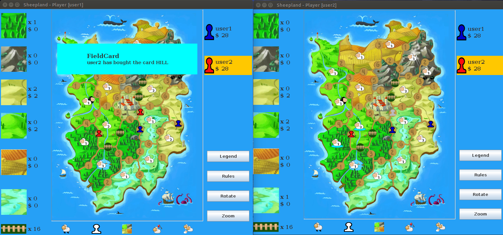

# What is sheepland?#
This is an online multiplayer board game project for the "Software engineer" course.
Rule of the game [here](SheepLand/doc/Sheepland_Rules.pdf)

# How to play #
0)Download the sheepland.jar file 
 [here](SheepLand/bin/sheepland.jar)

-------------------------------------------------------------------------

1)Start the server

1.1) Open a console and navigate to the folder of "sheepland.jar"

1.2) if LINUX: execute "sheepland.jar -s"

   if WINDOWS: execute "java -jar sheepland.jar -s"

   if MAC: execute "java -jar sheepland.jar -s"

-------------------------------------------------------------------------

2)Start a client

2.1) Open another console and navigate to the folder of "sheepland.jar"

2.2) if LINUX: execute "sheepland.jar -c"

   if WINDOWS: execute "java -jar sheepland.jar -c"

   if MAC: execute "java -jar sheepland.jar -c"

3) Follow the instructions

-------------------------------------------------------------------------

## More info ##
To start a game open the server and then at least 2 players.
When the fourth player makes the login the game starts.
After the second player makes the login a timer starts and the game begins within 20 seconds unless others arrive.

RMI and socket players can play together.

WARNING: Once the server is switched off all the data about the game and the players will be lost!

Enjoin!
